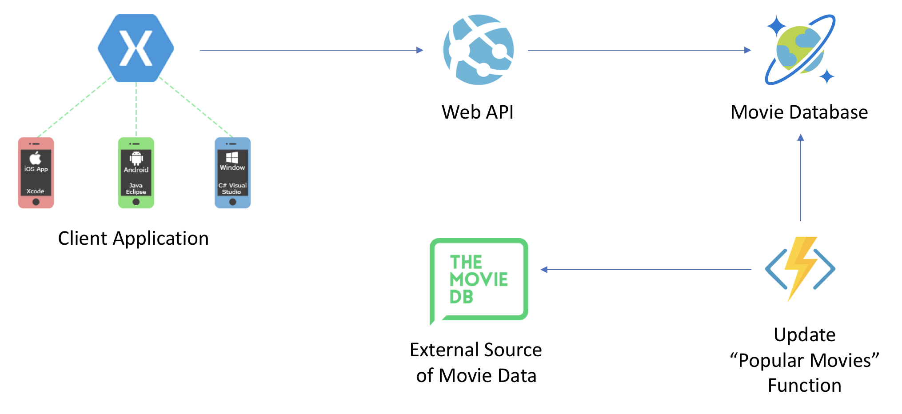

# Dutch Mobile & Azure Meetup 21-6-2018

Welcome to the Dutch Mobile & Azure Crossover Meetup! We will create a mobile application that let's you look up and view movie information. Here's the big picture:



# Web API

We've got a Cosmos DB instance up and running, pre-filled with a couple of movies. In this first part, you'll create a back-end Web API to expose the movie data to the client.

## Create a back-end API to get movie data
- Add a new **ASP.NET Core Web Application** project to the solution called *AppFlixApi*.
- When asked to select a template, choose **API**.
- Add a reference to the *Common* project.
- Rename `ValuesController` to `MoviesController`. 
- Add a method to list all movies in the Cosmos DB database:

```csharp
[HttpGet]
public async Task<IActionResult> Get()
{
    using (DocumentClient client = CosmosDBHelper.CreateDocumentClient())
    {
        var collectionUri = await client.GetDocumentCollectionUri();
        var movies = client.CreateDocumentQuery<MovieSummary>(collectionUri)
            .AsEnumerable()
            .OrderByDescending(movie => movie.Title)
            .ToList();

        return new JsonResult(movies);
    }
}
```

- And a method to get the details of a single movie:

``` csharp
[HttpGet("{id}")]
public async Task<IActionResult> Get(string id)
{
    using (var client = CosmosDBHelper.CreateDocumentClient())
    {
        var collectionUri = await client.GetDocumentCollectionUri();

        var movie = client.CreateDocumentQuery<MovieDetails>(collectionUri)
            .Where(m => m.Id == id)
            .AsEnumerable()
            .FirstOrDefault();

        if (movie != null)
        {
            return new JsonResult(movie);
        }

        return new NotFoundResult();
    }
}
```

- Start the API project, when you navigate to `api/movies`, you should see a list of movies.

## (Optional) Create your own Cosmos DB database
If you want, you can replace the default Cosmos DB instance with your own: 

- You can create a Cosmos DB of your own using the Azure Portal. Alternatively, you can download the [Cosmos DB Emulator](https://docs.microsoft.com/en-us/azure/cosmos-db/local-emulator).
- Update the `CosmosEndpointUrl` and `CosmosAuthorizationKey` constants in the `CosmosDBHelper` class.
- Now that you've got an empty database, add some movies to it! The format of the documents used in this tutorial is:

```json
{
    "id": "1",
    "title": "Raiders of the Lost Ark",
    "description": "In 1936, archaeologist and adventurer Indiana Jones is hired by the U.S. government to find the Ark of the Covenant before Adolf Hitler's Nazis can obtain its awesome powers.",
    "rating": 8.5
 }
```

# Mobile Application

Now that we got our back-end functionality up and running in Azure, let's create an app to consume it. Inspect the `AppFlix` solution stucture:
- The solution has a reference to the `Common`-project.
- Services: Logic to connect with the API in Azure we just created.
- Views: The UI of the application. `MoviesPage` will display a list of movies, `MovieDetailsPage` will display a single movie.
- ViewModels: The `BindingContext` for the views.
- We already provided you with a `BaseViewModel` that implements `INotifyPropertyChanged`. The `IsBusy`- and `Title`-property can be used in both View(Model)s, as well as the `MovieService`.
- We'll be using [Refit](https://github.com/reactiveui/refit) to connect to our API in Azure.

Depending on your preferece, set one of the heads (`.Android`, `.iOS` or `.UWP`) as your startup-project and you're ready to continue.

## Create the service to connect with Azure
- Modify the `IMovieApi` to call the two API methods available in Azure using [Refit](https://github.com/reactiveui/refit).

```csharp
[Get("/movies")]
Task<IEnumerable<MovieSummary>> GetMovies();

[Get("/movies/{id}")]
Task<MovieDetails> GetMovieDetails(string id);
```
- Modify the `MovieService` and make a `RestService` for the `IMovieApi`. Implement the methods to call the API.

```csharp
private const string API_BASE_URL = "YOUR_API_URL_HERE";
IMovieApi _movieApi;

public MovieService()
{
    _movieApi = RestService.For<IMovieApi>(API_BASE_URL);
}

public Task<MovieDetails> GetMovieDetails(string id)
{
    return _movieApi.GetMovieDetails(id);
}

public Task<IEnumerable<MovieSummary>> GetMovies()
{
    return _movieApi.GetMovies();
}
```

## Create the Movies-overview
- First, open up the `MoviesPage` (View) and add a `ListView` that'll hold the Movies that we retrieve from the API.
- Bind to the `Movies` Collection as `ItemsSource` and use `DataTemplate` to Bind to the individual `MovieSummary`.
- Bind to the `LoadItemsCommand` Command as `RefreshCommand` to execute whenever a `PullToRefresh` occurs.

```xml
<ListView x:Name="ItemsListView" 
    ItemsSource="{Binding Movies}"
    VerticalOptions="FillAndExpand"
        HasUnevenRows="true"
        RefreshCommand="{Binding LoadItemsCommand}"
        IsPullToRefreshEnabled="true"
        IsRefreshing="{Binding IsBusy, Mode=OneWay}"
        CachingStrategy="RecycleElement">
    <ListView.ItemTemplate>
        <DataTemplate>
            <ViewCell>
                <StackLayout Padding="10">
                    <Label Text="{Binding Title}" 
                        LineBreakMode="NoWrap" 
                        Style="{DynamicResource ListItemTextStyle}" 
                        FontSize="16" />
                </StackLayout>
            </ViewCell>
        </DataTemplate>
    </ListView.ItemTemplate>
</ListView>
```

- Open up the `MoviesViewModel` and implement the `ExecuteLoadItemsCommand` to call the `MovieService`.

```csharp
IsBusy = true;

try
{
    Movies.Clear();
    var movies = await MovieService.GetMovies();
    foreach (var movie in movies)
    {
        Movies.Add(movie);
    }
}
catch (Exception ex)
{
    Debug.WriteLine(ex);
}
finally
{
    IsBusy = false;
}
```
- You should now be able to start your app and retrieve and see the list of movies stored in the Azure API.

## Create the MovieDetailsPage
- Modify the `MoviesPage` (View) and add an event when an item is selected
```xml
<ListView x:Name="ItemsListView" 
        ItemSelected="OnItemSelected">
    ...
</ListView>
```

- Handle this event in the _code behind_ of the XAML to open up the `MovieDetailsPage` by pushing it on the `Navigation`

```csharp
async void OnItemSelected(object sender, SelectedItemChangedEventArgs args)
{
    var item = args.SelectedItem as MovieSummary;
    if (item == null)
        return;

    await Navigation.PushAsync(new MovieDetailsPage(new MovieDetailsViewModel(item)));

    // Manually deselect item.
    ItemsListView.SelectedItem = null;
}
```

- Open up the `MovieDetailsPage` _code behind_ of the XAML and override the `OnAppearing`-method to execute the `LoadMovieCommand` om the ViewModel.

```csharp
protected override void OnAppearing()
{
    base.OnAppearing();

    viewModel.LoadMovieCommand.Execute(null);
}
```
- Implement the `ExecuteLoadMovieCommand`-method on the `MovieDetailsViewModel`.

```csharp
IsBusy = true;

try
{
    Movie = await MovieService.GetMovieDetails(_movieSummary.Id);
}
catch (Exception ex)
{
    Debug.WriteLine(ex);
}
finally
{
    IsBusy = false;
}
```

- You should now be able to start the app, retrieve an overview and navigate to the details-page as well.

# Import Popular Movies from TheMovieDatabase
As lazy developers, we want our database to be updated automatically on a periodic basis. This is a perfect task for an Azure Function. In this part, you'll create a Function to get the most popular movies from The Movie Database website and import them into the Cosmos DB database.

## Create a Function to periodically import popular movies

- Add a **Functions** project named `MovieImporter` to solution and select a **Timer trigger**.
- Rename your function to `ImportPopularMovies`.
- Add a reference to the *Common* project. 
- Add the *TMDbLib 1.0.0* NuGet package. This package allows us to easily query The Movie Database website.
- Add the following code to your function to get a list of popular movies and add them to the database:

```csharp
var tmdbClient = new TMDbClient("c6b31d1cdad6a56a23f0c913e2482a31");

var movies = await tmdbClient.GetMoviePopularListAsync();

using (var cosmosClient = CosmosDBHelper.CreateDocumentClient())
{
    var collectionUri = await cosmosClient.GetDocumentCollectionUri();

    foreach (var movie in movies.Results)
    {
        var movieDetails = new MovieDetails
        {
            Id = $"tmdb:{movie.Id}",
            Title = movie.Title,
            Description = movie.Overview,
            Rating = (decimal)movie.Popularity
        };

        await cosmosClient.UpsertDocumentAsync(collectionUri, movieDetails);
    }
}
```

- Running the function will import the movies into your Cosmos DB database. 


# Stretch Goal

If you've got time left, try to send a push notification to your mobile application when the database is updated with new movies. Azure offers the Notification Hub service for this scenario. You can find Step-by-Step Tutorials on implementing Notification Hubs [here](https://docs.microsoft.com/en-us/azure/notification-hubs/).